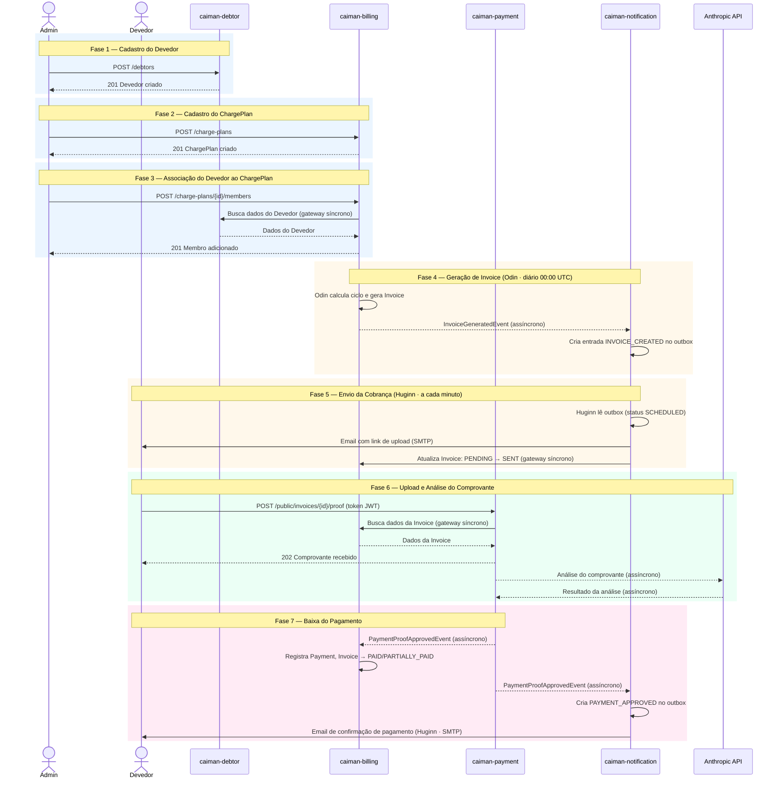

# Fluxo Completo — Comunicação entre Módulos

Diagrama de sequência alto nível do fluxo principal: cadastro → cobrança → pagamento → baixa.

**Notação:**
- Linha **sólida** (`->>`) = chamada **síncrona**
- Linha **tracejada** (`-->>`) = comunicação **assíncrona** (evento ou processamento em background)

---



---

## Notas

- **Fase 3** — `caiman-billing` nunca acessa diretamente o banco de `caiman-debtor`. A busca ocorre via gateway (`DebtorGateway`) definido em `caiman-contracts` e implementado em `caiman-debtor:infrastructure`.
- **Fase 6** — `caiman-payment` nunca acessa diretamente o banco de `caiman-billing`. A busca da Invoice ocorre via gateway (`InvoiceGateway`) definido em `caiman-contracts`.
- **Fase 7** — `PaymentProofApprovedEvent` é consumido de forma independente por `caiman-billing` (baixa financeira) e `caiman-notification` (notificação ao devedor). Ambos reagem ao mesmo evento publicado por `caiman-payment`.
- **Odin** (scheduler diário em `caiman-billing`) também detecta invoices vencidas e agenda lembretes de cobrança — esses ciclos de reminder seguem o mesmo caminho da Fase 5, mas com `trigger_type` `OVERDUE_REMINDER` ou `PENDING_REMINDER`.
- **Modo de validação manual** (`MANUAL` / `AI_ASSISTED`) adiciona uma etapa entre as Fases 6 e 7: o comprovante vai para a fila de revisão do admin antes da baixa.
```
