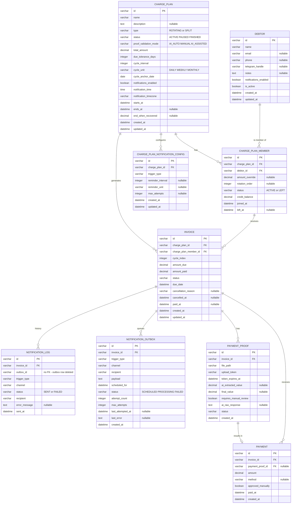

```mermaid
erDiagram
  DEBTOR {
    varchar id PK
    varchar name
    varchar email "nullable"
    varchar phone "nullable"
    varchar telegram_handle "nullable"
    text notes "nullable"
    boolean notifications_enabled
    boolean is_active
    datetime created_at
    datetime updated_at
  }

  CHARGE_PLAN {
    varchar id PK
    varchar name
    text description "nullable"
    varchar type "ROTATING or SPLIT"
    varchar status "ACTIVE PAUSED FINISHED"
    varchar proof_validation_mode "AI_AUTO MANUAL AI_ASSISTED"
    decimal total_amount
    integer due_tolerance_days
    integer cycle_interval
    varchar cycle_unit "DAILY WEEKLY MONTHLY"
    date cycle_anchor_date
    boolean notifications_enabled
    time notification_time
    varchar notification_timezone
    datetime starts_at
    datetime ends_at "nullable"
    decimal end_when_recovered "nullable"
    datetime created_at
    datetime updated_at
  }

  CHARGE_PLAN_NOTIFICATION_CONFIG {
    varchar id PK
    varchar charge_plan_id FK
    varchar trigger_type
    integer reminder_interval "nullable"
    varchar reminder_unit "nullable"
    integer max_attempts "nullable"
    datetime created_at
    datetime updated_at
  }

  CHARGE_PLAN_MEMBER {
    varchar id PK
    varchar charge_plan_id FK
    varchar debtor_id FK
    decimal amount_override "nullable"
    integer rotation_order "nullable"
    varchar status "ACTIVE or LEFT"
    decimal credit_balance
    datetime joined_at
    datetime left_at "nullable"
  }

  INVOICE {
    varchar id PK
    varchar charge_plan_id FK
    varchar charge_plan_member_id FK
    integer cycle_index
    decimal amount_due
    decimal amount_paid
    varchar status
    datetime due_date
    varchar cancellation_reason "nullable"
    datetime cancelled_at "nullable"
    datetime paid_at "nullable"
    datetime created_at
    datetime updated_at
  }

  PAYMENT {
    varchar id PK
    varchar invoice_id FK
    varchar payment_proof_id FK "nullable"
    decimal amount
    varchar method "nullable"
    boolean approved_manually
    datetime paid_at
    datetime created_at
  }

  PAYMENT_PROOF {
    varchar id PK
    varchar invoice_id FK
    varchar file_path
    varchar upload_token
    datetime token_expires_at
    decimal ai_extracted_value "nullable"
    decimal final_value "nullable"
    boolean requires_manual_review
    text ai_raw_response "nullable"
    varchar status
    datetime created_at
  }

  NOTIFICATION_OUTBOX {
    varchar id PK
    varchar invoice_id FK
    varchar trigger_type
    varchar channel
    varchar recipient
    text payload
    datetime scheduled_for
    varchar status "SCHEDULED PROCESSING FAILED"
    integer attempt_count
    integer max_attempts
    datetime last_attempted_at "nullable"
    text last_error "nullable"
    datetime created_at
  }

  NOTIFICATION_LOG {
    varchar id PK
    varchar invoice_id FK
    varchar outbox_id "no FK - outbox row deleted"
    varchar trigger_type
    varchar channel
    varchar status "SENT or FAILED"
    varchar recipient
    text error_message "nullable"
    datetime sent_at
  }

  DEBTOR ||--o{ CHARGE_PLAN_MEMBER : "is member of"
  CHARGE_PLAN ||--o{ CHARGE_PLAN_MEMBER : "has"
  CHARGE_PLAN ||--o{ CHARGE_PLAN_NOTIFICATION_CONFIG : "configures"
  CHARGE_PLAN ||--o{ INVOICE : "generates"
  CHARGE_PLAN_MEMBER ||--o{ INVOICE : "receives"
  INVOICE ||--o{ PAYMENT : "receives"
  INVOICE ||--o{ PAYMENT_PROOF : "has"
  PAYMENT_PROOF ||--o| PAYMENT : "results in"
  INVOICE ||--o{ NOTIFICATION_OUTBOX : "queues"
  INVOICE ||--o{ NOTIFICATION_LOG : "history"
```