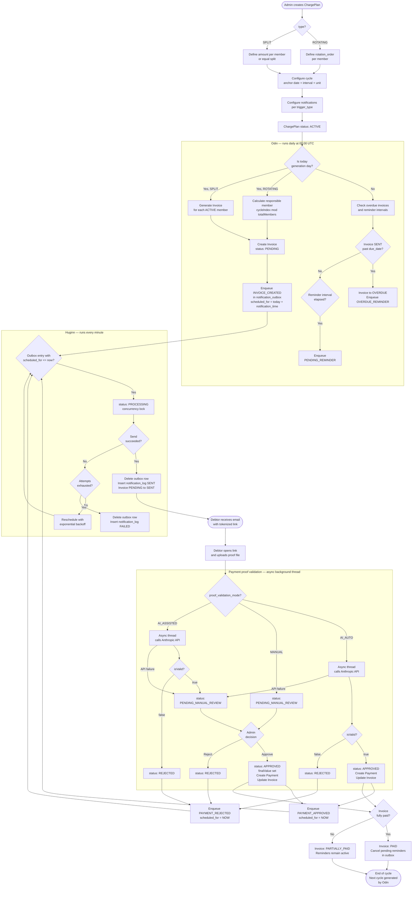

```mermaid
flowchart TD
  A([Admin creates ChargePlan]) --> B{type?}

  B -->|ROTATING| C[Define rotation_order\nper member]
  B -->|SPLIT| D[Define amount per member\nor equal split]
  C --> E[Configure cycle\nanchor date + interval + unit]
  D --> E
  E --> F[Configure notifications\nper trigger_type]
  F --> G[ChargePlan status: ACTIVE]

  G --> H

  subgraph ODIN ["Odin — runs daily at 00:00 UTC"]
    H{Is today\ngeneration day?}
    H -->|No| H2[Check overdue invoices\nand reminder intervals]
    H -->|Yes, ROTATING| I[Calculate responsible member\ncycleIndex mod totalMembers]
    H -->|Yes, SPLIT| J[Generate Invoice\nfor each ACTIVE member]
    I --> K[Create Invoice\nstatus: PENDING]
    J --> K
    K --> L[Enqueue INVOICE_CREATED\nin notification_outbox\nscheduled_for = today + notification_time]
    H2 --> M{Invoice SENT\npast due_date?}
    M -->|Yes| N[Invoice to OVERDUE\nEnqueue OVERDUE_REMINDER]
    M -->|No| O{Reminder interval\nelapsed?}
    O -->|Yes| P[Enqueue\nPENDING_REMINDER]
  end

  subgraph HUGINN ["Huginn — runs every minute"]
    Q{Outbox entry with\nscheduled_for <= now?}
    Q -->|Yes| R[status: PROCESSING\nconcurrency lock]
    R --> S{Send\nsucceeded?}
    S -->|Yes| T[Delete outbox row\nInsert notification_log SENT\nInvoice PENDING to SENT]
    S -->|No| U{Attempts\nexhausted?}
    U -->|No| V[Reschedule with\nexponential backoff]
    U -->|Yes| W[Delete outbox row\nInsert notification_log FAILED]
    V --> Q
  end

  L --> Q

  T --> X([Debtor receives email\nwith tokenized link])

  X --> Y[Debtor opens link\nand uploads proof file]
  Y --> Z{proof_validation_mode?}

  subgraph PROOF ["Payment proof validation — async background thread"]
    Z -->|AI_AUTO| AA[Async thread\ncalls Anthropic API]
    Z -->|MANUAL| AB[status:\nPENDING_MANUAL_REVIEW]
    Z -->|AI_ASSISTED| AC[Async thread\ncalls Anthropic API]

    AA --> AD{isValid?}
    AD -->|true| AE[status: APPROVED\nCreate Payment\nUpdate Invoice]
    AD -->|false| AF[status: REJECTED]

    AC --> AG{isValid?}
    AG -->|true| AH[status:\nPENDING_MANUAL_REVIEW]
    AG -->|false| AI[status: REJECTED]

    AA -->|API failure| AH
    AC -->|API failure| AH

    AB --> AJ{Admin\ndecision}
    AH --> AJ
    AJ -->|Approve| AK[status: APPROVED\nfinalValue set\nCreate Payment\nUpdate Invoice]
    AJ -->|Reject| AL[status: REJECTED]
  end

  AE --> AM[Enqueue PAYMENT_APPROVED\nscheduled_for = NOW]
  AK --> AM
  AF --> AN[Enqueue PAYMENT_REJECTED\nscheduled_for = NOW]
  AI --> AN
  AL --> AN

  AM --> Q
  AN --> Q

  AE --> AO{Invoice\nfully paid?}
  AK --> AO
  AO -->|Yes| AP[Invoice: PAID\nCancel pending reminders\nin outbox]
  AO -->|No| AQ[Invoice: PARTIALLY_PAID\nReminders remain active]

  AP --> AR([End of cycle\nNext cycle generated\nby Odin])
  AQ --> AR
```