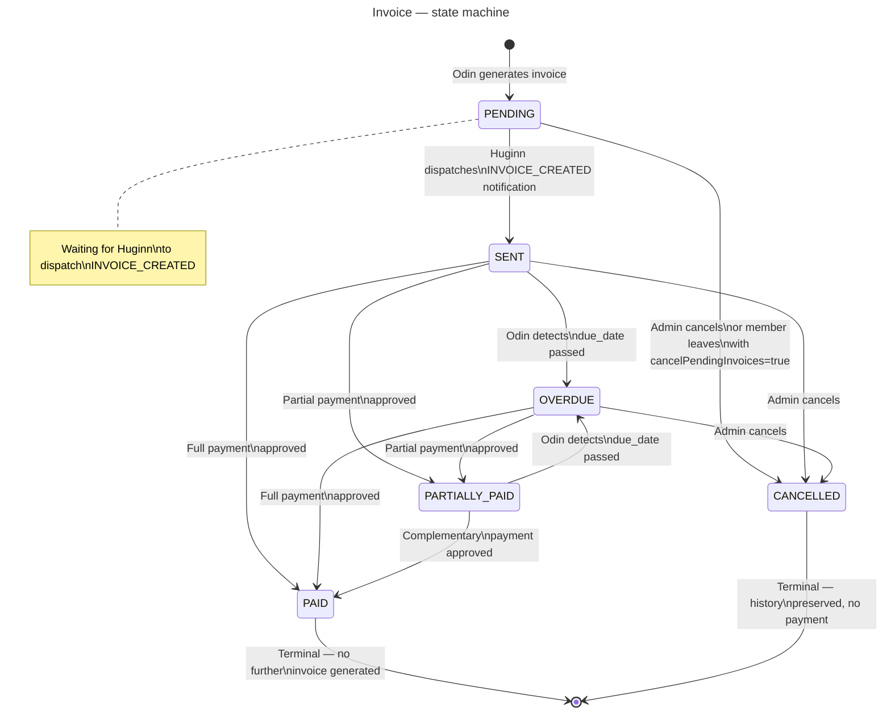

```mermaid
---
title: Invoice — state machine
---
stateDiagram-v2
  [*] --> PENDING : Odin generates invoice
  note right of PENDING : Waiting for Huginn\nto dispatch\nINVOICE_CREATED
  PENDING --> SENT : Huginn dispatches\nINVOICE_CREATED notification
  PENDING --> CANCELLED : Admin cancels\nor member leaves\nwith cancelPendingInvoices=true
  SENT --> OVERDUE : Odin detects\ndue_date passed
  SENT --> PARTIALLY_PAID : Partial payment\napproved
  SENT --> PAID : Full payment\napproved
  SENT --> CANCELLED : Admin cancels
  OVERDUE --> PARTIALLY_PAID : Partial payment\napproved
  OVERDUE --> PAID : Full payment\napproved
  OVERDUE --> CANCELLED : Admin cancels
  PARTIALLY_PAID --> OVERDUE : Odin detects\ndue_date passed
  PARTIALLY_PAID --> PAID : Complementary\npayment approved
  PAID --> [*] : Terminal — no further\ninvoice generated
  CANCELLED --> [*] : Terminal — history\npreserved, no payment
```