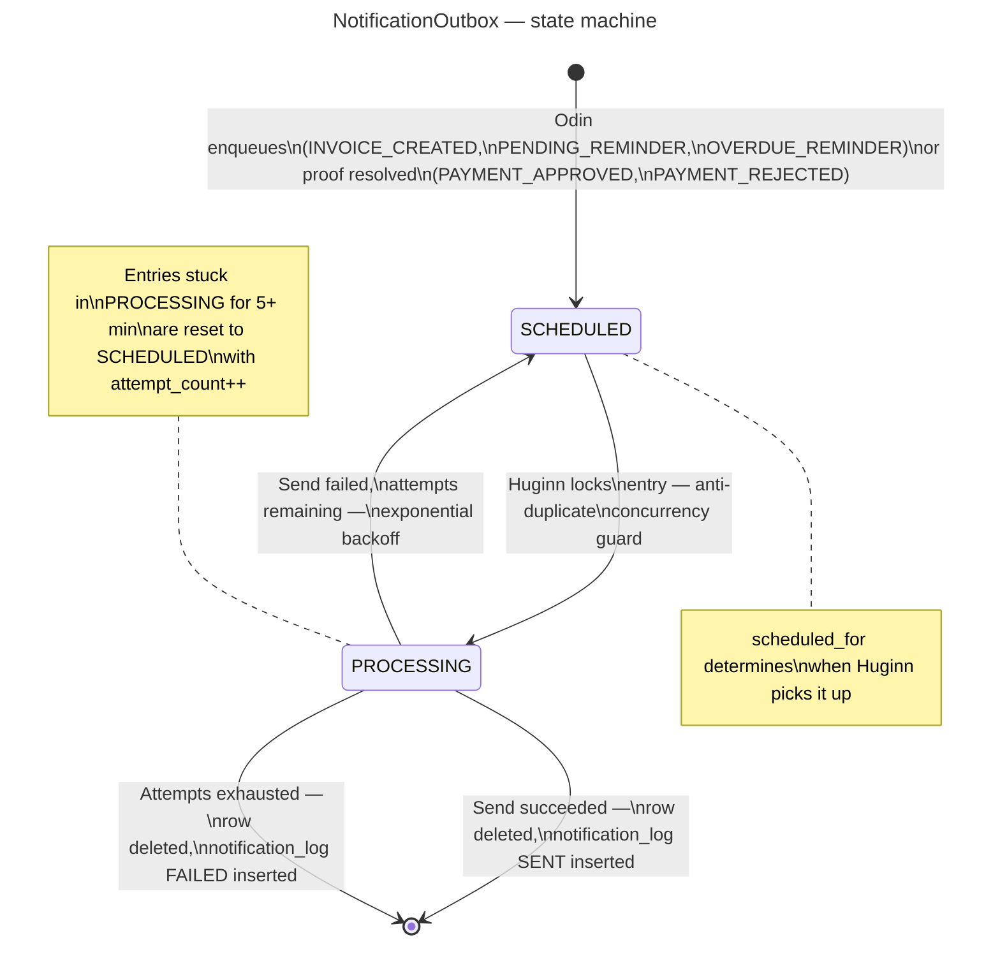

```mermaid
---
title: NotificationOutbox — state machine
---
stateDiagram-v2
  [*] --> SCHEDULED : Odin enqueues\n(INVOICE_CREATED,\nPENDING_REMINDER,\nOVERDUE_REMINDER)\nor proof resolved\n(PAYMENT_APPROVED,\nPAYMENT_REJECTED)

  note right of SCHEDULED : scheduled_for determines\nwhen Huginn picks it up

  SCHEDULED --> PROCESSING : Huginn locks\nentry — anti-duplicate\nconcurrency guard

  note left of PROCESSING : Entries stuck in\nPROCESSING for 5+ min\nare reset to SCHEDULED\nwith attempt_count++

  PROCESSING --> SCHEDULED : Send failed,\nattempts remaining —\nexponential backoff

  PROCESSING --> [*] : Send succeeded —\nrow deleted,\nnotification_log SENT inserted

  PROCESSING --> [*] : Attempts exhausted —\nrow deleted,\nnotification_log FAILED inserted
```