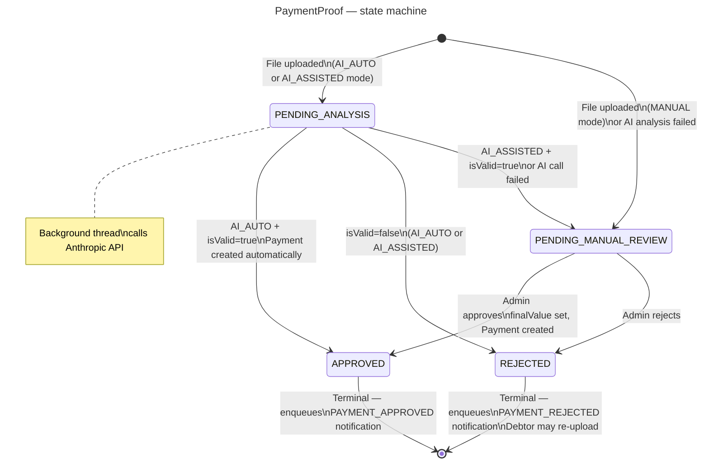

```mermaid
---
title: PaymentProof — state machine
---
stateDiagram-v2
  [*] --> PENDING_ANALYSIS : File uploaded\n(AI_AUTO or AI_ASSISTED mode)
  [*] --> PENDING_MANUAL_REVIEW : File uploaded\n(MANUAL mode)\nor AI analysis failed

  note right of PENDING_ANALYSIS : Background thread\ncalls Anthropic API

  PENDING_ANALYSIS --> APPROVED : AI_AUTO + isValid=true\nPayment created automatically
  PENDING_ANALYSIS --> REJECTED : isValid=false\n(AI_AUTO or AI_ASSISTED)
  PENDING_ANALYSIS --> PENDING_MANUAL_REVIEW : AI_ASSISTED + isValid=true\nor AI call failed

  PENDING_MANUAL_REVIEW --> APPROVED : Admin approves\nfinalValue set, Payment created
  PENDING_MANUAL_REVIEW --> REJECTED : Admin rejects

  APPROVED --> [*] : Terminal — enqueues\nPAYMENT_APPROVED notification
  REJECTED --> [*] : Terminal — enqueues\nPAYMENT_REJECTED notification\nDebtor may re-upload
```